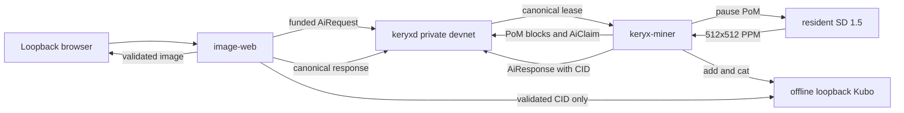

# Keryx image generation proposal

## Proposal

Add a private-devnet image generation path that lets one miner use the same resident SD 1.5 model for Proof of Model and inference. The proven slice adds deterministic request ownership, payable image responses, IPFS delivery, and a loopback-only web demonstration without changing mainnet or testnet behavior.

This is evidence for upstream discussion, not a deployment proposal. The claim rules, image model, web service, and legacy PoW bypass remain private-devnet only.

## Proven result

- SD 1.5 Q8_0 stays resident while PoM reads stable-diffusion.cpp-owned CUDA tensors.
- Image generation pauses PoM, synchronizes the GPU, generates one 512x512 image, and resumes PoM over unchanged tensor pointers.
- Competing miners claim one UTXO-backed lease. Canonical UTXO ordering selects one owner, and the payable response spends that lease exactly once.
- A requester can refund an unserved request after the fixed terminal timeout.
- Generated PPM files are committed by CID, retrieved through fixed loopback Kubo, checked against the UnixFS root block, and rendered by a loopback-only web service.
- Two independently funded requests completed from one browser action and recovered from the persisted journal after restart.
- Four studied quality levels use the existing `max_tokens` field: 12, 20, 30, and 40 steps. This avoids a wire-format change.

Detailed evidence is in `PHASE1_EVIDENCE.md`, `PHASE2_EVIDENCE.md`, `PHASE3_EVIDENCE.md`, and `SD_QUALITY_GUIDE.md`.

## Architecture



The browser has no wallet key, node endpoint, or Kubo endpoint. `image-web` owns the requester key, serializes funding, journals signed transactions before broadcast, follows canonical virtual-chain changes, and serves only validated results for tracked requests.

## Protocol delta

- `AiClaim` uses subnetwork ID `0x06` and signs the request transaction ID plus the spent state outpoint.
- Each request creates a UTXO state with a 100-DAA lease and a 1,000-DAA requester refund deadline.
- Competing claims spend the same state output. Normal canonical UTXO ordering chooses the winner.
- A response spends the active lease. UTXO single-spend rules provide exactly-once payout.
- Lease ownership follows selected-chain additions and removals. Rejected and rolled-back claims can be retried.
- Mainnet and testnet contextually reject the claim subnetwork.
- SD quality reuses `AiRequestPayload.max_tokens`. Legacy zero maps to the 12-step floor, and the miner clamps SD requests to 12 through 40.

## Runtime delta

- A narrow stable-diffusion.cpp C ABI exposes model-owned tensor names, lengths, storage types, and resident pointers.
- The miner commits to deterministic name-sorted resident bytes because stable-diffusion.cpp transforms 356 tensor representations while loading.
- Startup builds a host proof index, samples 129 distributed chunks against resident CUDA bytes, and fails closed on any mismatch.
- SD mode rejects raw-GGUF fallback because file bytes are not the authoritative resident representation.
- Inference blocks new PoM launches, synchronizes the active stream, generates through the existing model context, checks pointer stability, releases temporary allocations, and resumes PoM.

The resident commitment covers 1,127 complete tensors and 58,842,511 32-byte chunks. Its root is `49a167b499ca5631bd731e9717adbd41e8ce9a10c5b3222eb34d4289eda9fb2b`.

## Reproduction outline

Use disposable private-devnet state and never point these processes at official peers. The validated Windows toolchain and upstream pins are recorded in `NATIVE_BASELINE.md`.

The supported packaged path builds and launches the same GPU-enabled Compose stack on both platforms:

```powershell
.\demo.ps1 up
```

```bash
bash demo.sh up
```

Both launchers check their prerequisites, prepare and verify the model, create disposable keys, start the isolated services, wait for mature requester funds, and expose only `http://127.0.0.1:8080`. The native commands below remain useful for development and diagnosis.

Required model:

- Source: SD 1.5 `v1-5-pruned-emaonly.safetensors`
- Source SHA-256: `6ce0161689b3853acaa03779ec93eafe75a02f4ced659bee03f50797806fa2fa`
- Q8_0 GGUF SHA-256: `9685394cae6ede69f28d1799ad54bd7c059a941eb3d3054802bf318422294745`

Build stable-diffusion.cpp after loading `vcvars64.bat`:

```powershell
cmake --fresh -S . -B build-native -G Ninja -DCMAKE_BUILD_TYPE=Release -DSD_CUDA=ON -DSD_BUILD_SHARED_LIBS=ON -DSD_WEBP=OFF -DSD_WEBM=OFF -DCMAKE_CUDA_ARCHITECTURES=86 -DCMAKE_CXX_FLAGS=/bigobj
cmake --build build-native --config Release -j 8
```

Build the changed node and web service:

```powershell
cd upstream/keryx-node
cargo build --release -p keryxd -p rothschild
```

Build the native image miner:

```powershell
cd upstream/keryx-miner
$env:NVCC = 'path\to\nvcc-12.4.cmd'
$env:CUDA_PATH = 'C:\Program Files\NVIDIA GPU Computing Toolkit\CUDA\v13.3'
$env:KERYX_LLAMA_SKIP = '1'
cargo build --release -p keryx-miner
```

Initialize a disposable Kubo repository, remove bootstrap peers, disable mDNS, and run offline with loopback API and gateway addresses:

```powershell
$env:IPFS_PATH = "$PWD\runtime\ipfs"
ipfs init
ipfs bootstrap rm --all
ipfs config Addresses.API /ip4/127.0.0.1/tcp/5001
ipfs config Addresses.Gateway /ip4/127.0.0.1/tcp/8081
ipfs config --json Discovery.MDNS.Enabled false
ipfs daemon --offline --routing=none
```

Start a fresh loopback-only node. `--reset-db` deletes the selected disposable data directory:

```powershell
.\upstream\keryx-node\target\release\keryxd.exe `
  --devnet `
  --appdir .\runtime\keryxd `
  --rpclisten=127.0.0.1:32110 `
  --listen=127.0.0.1:32111 `
  --rpclisten-borsh=127.0.0.1:33110 `
  --rpclisten-json=127.0.0.1:34110 `
  --outpeers=0 `
  --maxinpeers=0 `
  --disable-upnp `
  --enable-unsynced-mining `
  --utxoindex `
  --reset-db
```

Start the miner with the exact GGUF. Use the requester address as the mining address so the web key receives mature devnet UTXOs:

```powershell
$env:KERYX_SD_MODEL = 'path\to\sd-v1-5-q8_0.gguf'
.\upstream\keryx-miner\target\release\keryx-miner.exe `
  --keryxd-address 127.0.0.1 `
  --port 32110 `
  --mining-address $RequesterAddress `
  --ipfs-url http://127.0.0.1:5001 `
  --mine-when-not-synced
```

Start the web service after the requester has mature UTXOs. The private key file contains the matching hex secret and must remain local:

```powershell
.\upstream\keryx-node\target\release\image-web.exe `
  --listen 127.0.0.1:8080 `
  --rpc 127.0.0.1:32110 `
  --private-key-file .\runtime\requester.key `
  --ipfs-api 127.0.0.1:5001 `
  --journal .\runtime\image-web.ndjson
```

Open `http://127.0.0.1:8080`, submit one image, and confirm that the request reaches `image_available`. A restart of `image-web` with the same journal must recover the request, response, CID, exact seed, and image.

## Verification record

The following changed-code checks passed on the final Phase 3 tree:

```powershell
cd upstream/keryx-node
cargo test --release -p keryx-inference -p keryx-consensus-core -p keryx-consensus -p keryx-rpc-service -p rothschild
cargo build --release -p keryxd -p rothschild

cd ../keryx-miner
cargo test --release -p keryx-inference
cargo test --release -p keryx-miner --lib
cargo build --release -p keryx-miner
```

Node protocol, RPC, and Rothschild tests passed. Miner library tests passed 16 with 2 ignored. The native release miner built successfully. Known upstream baseline defects are listed in `NATIVE_BASELINE.md`.

The packaged Windows Docker Desktop run also passed:

```text
docker compose build demo
docker compose up -d --no-build --force-recreate
.\demo.ps1 up
cargo test --release -p rothschild
docker compose config -q
bash -n demo.sh demo/entrypoint.sh
PowerShell AST parse: demo.ps1
```

The final local image was `sha256:e57199e3425de8b1ed75674562da283b5d34a181a699382a2122337378659294`. The Windows launcher built the cached image, detached cleanly, waited for spendable requester funds, and returned the browser URL. Docker reported the service healthy before the browser was opened. A Balanced request then completed with no browser console errors:

| Field | Value |
| --- | --- |
| Request | `4282122fa9dabe3cec2c29425de7b4d2df414aedd64de347099753099e307575` |
| Seed | `4377176308024771138` |
| Claim | `3f68333834b733ac04c09d05bd2fbf13a13227e84dda7c7b4738689477437bb5` |
| Response | `ee6bde5f03c13311016bf3155094613661c594552ee2c071f0a185f5f5ee880a` |
| CID | `QmPfgeDJDkD22H6zaqxCfgwx3thXtjqJr5nz3BsCxJ6FXK` |
| Result | Valid `P6` 512x512 PPM, 786,447 bytes |

After `docker compose restart demo`, the journal replay restored the same request, seed, response, CID, and `image_available` state. The packaged `rothschild` test run passed 16 tests with no failures.

The clean Ubuntu 22.04 GPU run also passed:

```bash
bash demo.sh doctor
bash demo.sh up
docker compose restart demo
```

The host used an RTX 5090, NVIDIA driver 580.95.05, Docker Engine 28.1.1, Docker Compose 2.35.1, and NVIDIA Container Toolkit 1.19.1. Starting without a `models` directory exercised the complete preparation path: the launcher downloaded the official 4,265,146,304-byte source model, verified its hash, converted it to Q8_0, verified the GGUF hash, built image `sha256:1305493158e29446c6e69765f8d2da534e9e9f46660d57a13ceac36235f93ca0`, and reached Docker healthy status. A Max request completed with no browser console errors:

| Field | Value |
| --- | --- |
| Request | `457513272564bcefcaf42442c7b3f5676f8290c67d17ee7a05bc071d4e6cb573` |
| Seed | `17274792381418534213` |
| Claim | `2a20ae877a84f0b6b8922926402fdccb7966ae3d2e7a36288611f88a4cf19374` |
| Response | `9871a79c0ff5cb4d9bb542aa9989881bd5988d36ca3cb61b1e471055473079a9` |
| CID | `QmaihscaZKiuV78DuoL5PHxQti1PRKw5HG8FZVJon8X5kn` |
| Result | Valid `P6` 512x512 PPM, 786,447 bytes |

After restart, the same request, seed, response, CID, image, and `image_available` state returned from the persisted journal and canonical chain. Docker remained healthy and exposed only `127.0.0.1:8080` on the host.

The browser also exported a selected result as a 512x512 PNG. The 457,322-byte download had the standard `89504e470d0a1a0a` PNG signature and a filename derived from its request transaction ID.

## Measurements

| Measurement | Result |
| --- | --- |
| RTX 3070 resident tensor allocation | 1,882,960,396 bytes, about 1,796 MiB |
| RTX 3070 GPU-wide baseline | 2,608 MiB |
| RTX 3070 GPU-wide peak | 6,381 MiB |
| RTX 3070 observed delta | 3,773 MiB |
| RTX 3070 model load plus 4-step image | 3.08 seconds |
| RTX 5090 12-step mean | 0.762 seconds |
| RTX 5090 20-step mean | 1.223 seconds |
| RTX 5090 30-step mean | 1.799 seconds |
| RTX 5090 40-step mean | 2.374 seconds |
| PoM and image stress | 3 pause, generate, pointer-check, resume cycles passed |
| Two-miner contention | Winner inferred once; loser inferred zero times |
| Winning lease churn | 1,062 confirmations with cached response replay |
| Losing claim churn | 1,082 attempts with no winning lease |
| Browser two-image proof | Two independent 786,447-byte PPM results |

The RTX 5090 timings come from the controlled 144-image study. They are not cross-hardware latency guarantees. The PoC did not record a protocol-level pause duration or sustained request throughput, so neither is claimed.

## Limits and risks

- This is private-devnet code. Mainnet and testnet deployment are not proposed.
- The output is model-resident and content-addressed. The protocol does not prove that an image semantically matches its prompt.
- SD 1.5 at 512x512 has known anatomy, multi-subject, text, and geometry limits. More diffusion steps do not reliably fix them.
- The web service trusts other processes on the same machine. Any local process that can reach its POST endpoint can spend configured requester funds.
- Prompts and IPFS results are public. Sensitive prompts are unsupported.
- Kubo is a fixed loopback dependency. The service does not proxy arbitrary CIDs.
- Stable-diffusion.cpp internals can change. The permanent patch should remain limited to one tensor-introspection wrapper and the small Keryx ABI.
- Claim and lease consensus must continue to derive only from canonical DAA and block state.
- CUDA and GGML stream synchronization is mandatory before inference.
- Supporting more models would require separate resident-byte canonicalization, VRAM measurement, and failure gates.

## Publication blockers

The packaged demonstration works on Windows and Ubuntu, but Phase 4 and this proposal are not ready to send upstream yet:

- Phase 3 changes are still uncommitted in the root, `upstream/keryx-node`, and `upstream/keryx-miner` worktrees.
- No fork URL or public demonstration URL exists. Official origin remotes are read-only for this work.

Resolve those items in a user-owned fork or artifact location. Do not push to the official origins or open an official-origin pull request from this workspace.
